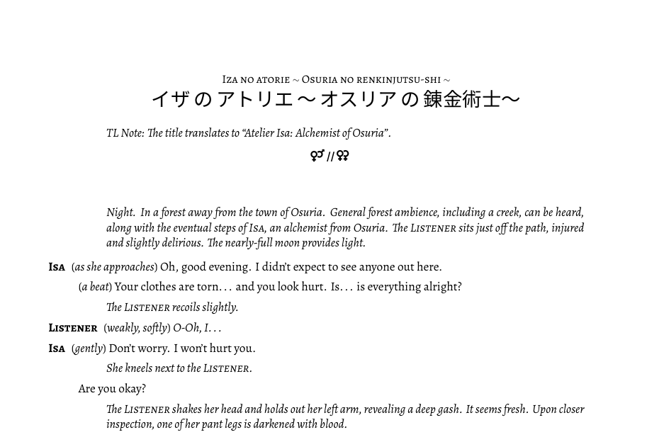

# lilasmr

A simple Python script that allows for an easier creation of LaTeX-rendered play-script files.

## Introduction and Motivation

While I'm certainly not a TeX wizard, I'm fairly comfortable writing in LaTeX, especially when getting something like LibreOffice or Google Docs to format correctly is hard. So, when I started writing ASMR-roleplay scripts, I naturally chose to do it LaTeX so that I could get something that looks like this:



Getting LibreOffice to do that is certainly possible, but it involves handling different font styles, and switching between them within the same paragraph (because I want the names offset to the left, rather than on their own lines) is annoying.

But on the other hand, even with a separate `main.tex` file handling the format as a template, my "script" still looked like this:

```LaTeX
% set scene title
\renewcommand{\SceneName}{\ruby{イザ\,の\,アトリエ\,〜\,オスリア\,の\,錬金術士〜}{Iza no atorie \Tilde{} Osuria no renkinjutsu-shi \Tilde{}}}
\thispagestyle{cfirstpage}

% define necessary characters
\Character{Isa}{Isa}
\Character{Listener}{Listener}

\begin{drama}
\item{\scene[\SceneName]}

\StageDir{TL Note: The title translates to ``Atelier Isa: Alchemist of Osuria''.}

\ffa % female-for-all

\StageDir{Night. In a forest away from the town of Osuria. General forest ambience, including a creek, can be heard, along with the eventual steps of \Isa, an alchemist from Osuria. The \Listener sits just off the path, injured and slightly delirious. The nearly-full moon provides light.}

\Isaspeaks{\direct{as she approaches} Oh, good evening. I didn't expect to see anyone out here.}
\continue{\direct{a beat} Your clothes are torn\ldots and you look hurt. Is\ldots is everything alright?}

\StageDir{The \Listener recoils slightly.}

\Listenerspeaks{\direct{weakly, softly} \textit{O-Oh, I\ldots}}

\Isaspeaks{\direct{gently} Don't worry. I won't hurt you.}
    \StageDir{She kneels next to the \Listener.}
\continue{Are you okay?}

\StageDir{The \Listener shakes her head and holds out her left arm, revealing a deep gash. It seems fresh. Upon closer inspection, one of her pant legs is darkened with blood.}

    ---cut---
```

That's not... terrible, I suppose? But it's still relatively complicated, and it's hard to share (other than a pdf), which may not be ideal for collaborative editing, or for encouraging other people to get started.

**So that's what this project is for.**

## What does this project do?

`lilasmr`, despite its name, isn't just designed for my ASMR scripts, but for any similar "play"-like script. The project is designed to allow for the user to write a script in a "friendly" file format that is meant to be accessible to new(er) writers. While LaTeX is great for making beautiful documents, getting the formatting right shouldn't stand in the way of the writing.

So, this project takes the "friendly" script and simply converts it to a .tex file that, alongside a preamble defining the configuration and style, gets rendered into a pdf. In short, this project acts as a converter (...or a wrapper around) between this new file format and a nicely-formatted pdf.

Of course, those complicated LaTeX commands? They're still available. Notice that I have a `\ffa` in the source of that script, which is a command defined in my preamble. When `lilasmr` saw that, it just ignored it and passed it along as it was. So, people who want the additional flexibility can still use their LaTeX experience if they want.

## Installation // How can I use this project?

Unfortunately, because this is still an alpha build, it is Linux-only. I want to make sure that it's working properly and does what I need it to before I work on abstracting some of the Linux-specific filepaths or whatever. But my goal is to make this accessible on all platforms in the future.

On Linux, though:

### Prerequisites

- a LaTeX (specifically, xelatex) compiler
- LaTeX support for the Alegreya font (optional, though you'd have to change the preamble)

```bash
# Ubuntu
sudo apt install texlive-base texlive-xelatex
sudo apt install texlive-fonts-extra  # for alegreya
```

- Python 3.6+

This project was specifically written and tested in Python 3.8.10, but any version from 3.6 onward should work. Many newer releases of Linux distributions come with a recent release of Python, so this may not be necessary to install.

```bash
# verify Python version is 3.6+
python3 --version

# if you do need a new version...
# replace "3.10.2" with whichever version number you want
sudo apt install zlib-devel

wget https://www.python.org/ftp/python/3.10.2/Python-3.10.2.tar.xz
tar -xf Python-3.10.2.tar.xz
cd ./Python-3.10.2
./configure && make && sudo make altinstall
```

- `git` (or just download this repository from Github)

```bash
sudo apt install git-all
```

### Installation and Usage

1. Download this repository.

```bash
git clone https://github.com/lilellia/lilasmr.git
```

2. From within the directory, run `install.py`. This will (inelegantly) create a configuration file and an executable file.

```bash
cd lilasmr
python3 ./install.py
```

3. Make the created executable file... actually executable. Currently, it is written to `$HOME/.local/bin/lilasmr`.

```bash
sudo chmod +x $HOME/.local/bin/lilasmr
```

4. To run the script...

```bash
# standard command
lilasmr path/to/script.asmr -o path/to/output.pdf

# To use a different author than the config file's default:
lilasmr ... -a "new author"
lilasmr ... --author "new author"

# By default, lilasmr sets the PDF title to match
# the pdf filename. To use a different one:
lilasmr ... -t "new title"
lilasmr ... --title "new title"

# lilasmr will even accept multiple script files,
# and will simply join them one after the other
lilasmr script1.asmr script2.asmr ... -o output.pdf
```

## The configuration file

This is written to `$HOME/.config/lilasmr/config.ini`. It has the following form

```ini
[Defaults]
PDFTitle = @filename
ScriptAuthor = lilellia
TeXPreamble = /home/lily/.local/share/lilasmr/src/preamble.tex
```

and defines the default parameters for the compilation. The PDF title defaults to `@filename`, which is LaTeX's default anyway.

The `TeXPreamble` should be an absolute path to the preamble file (TeX configuration/header, of a sort) that she be used. By default, it's the one I've been using, and it's stored in this repository in `./src/preamble.tex`. I've placed this repository in my own `$HOME/.local/share`, so that's what the default is at present.

With the default preamble, the script author is rendered into the footnote on each page.

## The .asmr file format

Note: The file extension does not need to be .asmr: in essence, this is just a .txt file with some specifications. My use of .asmr is just a convention.

Because this is a brand-new file format specification, there may be some changes. Any major changes will be able to be handled by specifying the converter's version.

### asmr-format-v0.8

The file consists of two main sections: the "header" and the "body". These are divided by a line that reads `===START===` with no other non-space characters on the line.

All blank lines are ignored, and any non-tag segment can contain additional LaTeX commands, which are passed through without adjustment.

The header should include the script's title and a list of characters that can appear in the script. The title should be on one line, preceded by the `TITLE:` tag; characters are a subsection which begins with the `CHARACTERS:` tag, and each character should appear on its own line. Characters must appear as a bullet list, and the bullets must be indented. As an example:

```text
TITLE: Expressions of Love
CHARACTERS:
    - Isa
    - Claire
    - Listener

===START===
```

Everything after `===START===` is part of the body. In most cases, this will consist of dialogue and stage directions. Dialogue is written as

```text
ISA: This is one line that Isa is saying.
```

where the name should appear in all caps and be terminated by a colon. **This must be a name which appeared in the characters list in the header.** The sole exception to this rule is the dialogue continuation, when the same character speaks more than one line: in this case, write the name as a series (any length) of hyphens. For example:

```text
ISA: This is one line that Isa is saying.
---: And this is another, even though the speaker isn't specified.
```

Dialogue continuations will not render the character's name for subsequent lines, even if there were, e.g., stage directions between the lines.

Stage directions are handled similarly to dialogue, except they begin with `STAGE:`. (This means that a character in the script cannot be named "Stage" since their dialogue would be rendered instead as stage directions.)

```text
ISA: This is one line that Isa is saying.
STAGE: She walks over the window.
--- And this is another, even though the speaker isn't specified.
```

#### Text formatting

asmr-format-v0.8 uses common markdown styling for text:

- `*text*` appears as italics: *text*
- `**text**` appears as bold: **text**
- `__text__` appears underlined: <span style="text-decoration: underline;">text</span> (note: this may not appear correctly here)
- `~~text~~` appears as strikethrough text: ~~text~~

Though it is not standard markdown, double-brackets also get converted to inline stage directions:
- `[[text]]` becomes an inline stage direction: *(text)*

There are two additional details that the lilasmr rendering engine handles:
- a literal ellipsis (`...`) gets converted to the LaTeX command `\ldots`. With the `ellipsis` package (and its `xspace` option), this should provide improved spacing, especially around punctuation marks. The engine also changes this to `\ldots{}` when the following character is alphanumeric in order to suppress the (usually undesired) additional space.
- double-quotation marks are converted to correct LaTeX ``` `` ``` (opening double-quotation marks) and ``` '' ``` (closing double-quotation marks).

That is:

```text
ISA: You know... [[she trails off]] That's a good point.
CLAIRE: ...Hmm? Is it?
------: Didn't you say that we should "always be careful"?
```

gets converted to

```LaTeX
\Isaspeaks{You know\ldots \direct{she trails off} That's a good point.}
\Clairespeaks{\ldots{}Hmm? Is it?}
\continue{Didn't you say that we should ``always be careful''?}
```